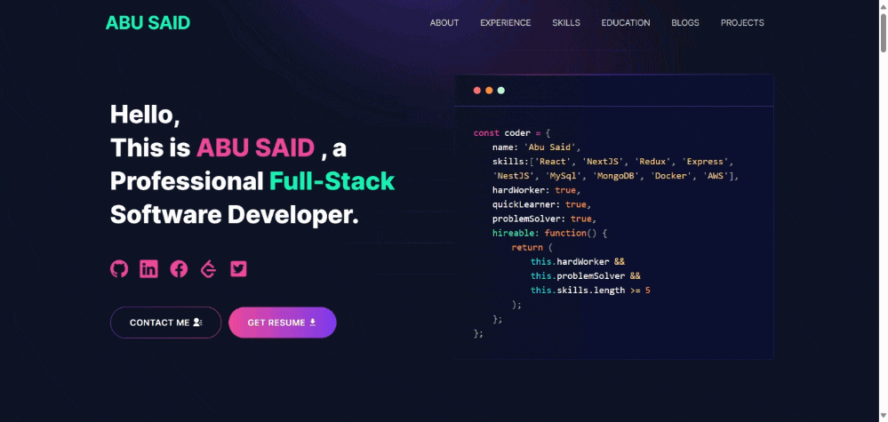

# Developer Portfolio

#### Want to create a professional Portfolio website but cannot figure out how to? Use Developer Portfolio template and create your own personalised portfolio today!

#### My easily customisable, user friendly website is designed to cater to developers and freelancers a like.

---

# Demo :movie_camera:



## View live preview [here](https://abusaid.netlify.app/).

---

## Table of Contents :scroll:

- [Sections](#sections-bookmark)
- [Demo](#demo-movie_camera)
- [Installation](#installation-arrow_down)
- [Getting Started](#getting-started-dart)
- [Folder Structure](#folder-structure-open_file_folder)
- [Usage](#usage-joystick)
- [Hosting](#hosting-globe_with_meridians)
- [SEO](#seo-spider)
- [Packages Used](#packages-used-package)
- [APIs Used](#apis-used-world_map)
- [Fonts and Images](#fonts-and-images-performing_arts)
- [Upcoming Features](#upcoming-features-construction)
- [Contributors](#contributors-man_technologistwoman_technologist)

---

# Sections :bookmark:

- HERO SECTION
- ABOUT ME
- EXPERIENCE
- SKILLS
- PROJECTS
- EDUCATION
- BLOG
- CONTACTS

---

# Installation :arrow_down:

### You will need to download Git and Node to run this project

- [Git](https://git-scm.com/downloads)
- [Node](https://nodejs.org/en/download/)

#### Make sure you have the latest version of both Git and Node on your computer.

```
node --version
git --version
```

## <br />

# Getting Started :dart:

### Fork and Clone the repo

To Fork the repo click on the fork button at the top right of the page. Once the repo is forked open your terminal and perform the following commands

```
git clone https://github.com/<YOUR GITHUB USERNAME>/developer-portfolio.git

cd developer-portfolio
```

### Install packages from the root directory

```bash
npm install
# or
yarn install
```

Then, run the development server:

```bash
npm run dev
# or
yarn dev
```

Open [http://localhost:3000](http://localhost:3000) with your browser to see the result.
